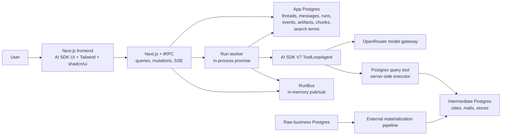

# 01 System Architecture

## Architecture Overview

V1 runs as one long-lived Next.js service backed by Postgres. The same process
serves the UI, exposes the tRPC API, starts in-process agent runs, publishes
live stream chunks through an in-memory RunBus, and sweeps stale runs.

There are two Postgres databases:

- **App Postgres** stores product state: threads, messages, runs, events,
  artifacts, persisted stream chunks, and the app-managed title-search index.
- **Intermediate Postgres** is the read-only analytical database the agent can
  query through typed tools.

Raw business Postgres remains outside the agent runtime path and feeds the
intermediate database through an external materialization pipeline.



## Key Decisions

- **Hosting:** one Railway service running `next start` with boot hooks for the
  worker support code, sweeper, and deploy drain. The service is intentionally
  long-lived; live runs are not tied to serverless request lifetimes.
- **App database:** Railway Postgres in production, local Postgres in
  development. The app uses `pg` plus Drizzle over `DATABASE_URL`; with one
  long-lived process, no PgBouncer or Redis is required for V1.
- **Search:** standard Railway Postgres only. V1 does not require custom
  Postgres extensions such as PGroonga or `pg_trgm`; the app tokenizes titles
  into English terms and Chinese bigrams and stores them in a separate search
  index table.
- **Migrations:** schema lives in `src/server/db/schema.ts`; generated
  migrations live in `drizzle/` and apply once at boot.
- **API:** tRPC v11 + React Query provides typed queries, mutations, and the
  `runs.stream` SSE subscription.
- **Streaming transport:** SSE via `httpSubscriptionLink`. Client-to-server
  actions such as send, stop, edit, retry, and clarification answers are plain
  mutations, so V1 does not need a websocket server.
- **Scale-out:** the RunBus is in-memory because V1 runs one process. If the
  app ever runs more than one replica, swap RunBus for Redis pub/sub behind the
  same interface.
- **Langfuse posture (V2 target):** Langfuse is an async observability sink,
  not source of truth. App Postgres keeps product state and data artifacts;
  Langfuse receives trace/session metadata, model usage, tool activity, and SQL
  statements once tracing is enabled.

## Component Responsibilities

### Frontend

- Claude-like chat shell: collapsible sidebar (pinned + recent sessions), conversation
  column, global search modal, and on-demand artifact panel.
- Artifact panel selection is run-scoped: global artifact navigation opens the latest
  run, while each assistant response can open the artifacts for its own run.
- Stream reasoning, tool calls, and intermediate text live in a single open work
  block per turn, which collapses into a `Worked for Ns` summary when the final
  response starts streaming.
- Reattach to in-flight runs after a refresh: rebuild the live view from
  persisted stream deltas and keep streaming from the run stream subscription.
- Render chat, tool activity, results, charts, and analysis artifacts.
- Use AI SDK UI for streaming agent messages (text, reasoning, and tool parts).
- Use Tailwind and shadcn/ui for layout and controls.
- Use tRPC React Query hooks for API data and invalidation.
- Keep SQL visible and copyable.

### App Backend And tRPC

- Store application state in App Postgres, not analytical data.
- Own threads, messages, runs, run events, artifacts, stream chunks, and the
  title-search index.
- Expose tRPC routers for chat actions, thread/message reads, run status and
  streaming, artifacts, and events.
- Resolve the signed-in Clerk user in tRPC context and filter owned data by
  `ctx.userId`.
- Start a run worker only after the run-creating transaction commits.
- Reject new runs while the service is draining for deploy shutdown.

### Run Worker And Sweeper

- Execute the `ToolLoopAgent` for the run created by the chat mutation.
- Pass runtime context: user, thread, run, model alias, active skill set, and
  skill version.
- Append UI message stream chunks as JSONL lines, publish them immediately to
  RunBus, and persist them to `run_chunks` for replay.
- Bridge agent events into run logs and artifacts through Drizzle helpers.
- Call Postgres tools through server-side executor dependencies.
- Check stop requests and stamp run heartbeats at step boundaries.
- Sweep stale running runs and finalize them as failed with visible partial
  output when possible.
- On SIGTERM/SIGINT, stop accepting new runs, allow a grace window for active
  runs, abort survivors, flush chunks, and finalize remaining runs.

### AI SDK Agent Runtime

- Use `ToolLoopAgent` for interactive analysis.
- Use tools to inspect schema, run SQL, save artifacts, and present data views.
- Use local agent skills to steer domain behavior.
- Use OpenRouter model aliases through a central model registry.

### App Postgres

- Hold product state for threads, messages, runs, run events, artifacts, stream
  chunks, and search index rows.
- Store all IDs as UUIDv7 values generated app-side.
- Keep `user_id text` on owned rows because Clerk user IDs are strings;
  BetterAuth would fit the same ownership column if adopted later.
- Store stream chunks only as transient replay data; finalized assistant
  messages carry the full renderable parts.

### Intermediate Postgres

- Hold queryable business analysis tables.
- Expose read-only credentials to the agent query tool.
- Apply database-level safety settings such as read-only role and statement timeouts.

### Raw Business Postgres

- Not accessed by the agent.
- Feeds the intermediate database through an external materialization pipeline.

## App Postgres Schema

The canonical schema is `src/server/db/schema.ts`.

| Table | Purpose |
| --- | --- |
| `threads` | User-owned chat sessions with title, pin state, and timestamps. Indexed by `user_id`, `pinned`, and `updated_at` for sidebar queries. |
| `messages` | User and assistant turns. Assistant rows store final text, full render parts, compact tool-line summaries for history, run linkage, status, and duration. |
| `runs` | Agent execution lifecycle: status, stop request, heartbeat, model and skill metadata, message links, retry anchor, timing, error, finish reason, counters, and usage. A partial unique index (`one_live_run_per_thread`) allows only one `running` run per thread. |
| `run_events` | Ordered structured events for debugging and the developer run-events panel. |
| `artifacts` | SQL, table, view, finding, and error artifacts tied to runs and optionally messages. `chartSpec` remains in the type union for legacy rows; new charts use `view`. Full payloads are fetched only for the selected panel run; thread-level UI badges use lightweight summaries. |
| `run_chunks` | Persisted live stream replay. Each row is one JSONL-encoded UI message chunk line keyed by `(run_id, seq)`. The run is the stream; clients subscribe by `runId` and resume by sequence cursor. |
| `search_terms` | App-managed title-search index. V1 stores one row per normalized title token/bigram, scoped by `user_id`, `thread_id`, `source_kind` (`thread_title`), `source_id` (the thread id for title rows), and `term`. The table is maintained by thread create/rename/delete code instead of adding search columns to `threads`. |

## Search Indexing

V1 search targets chat titles only. The search index is deliberately separate
from `threads` and `messages` so title search can evolve without bolting
derived token data onto canonical product rows.

Tokenization is app-side:

- English and number text is lowercased and split into normalized terms.
- Chinese/CJK title text is expanded into overlapping bigrams; single-character
  fallback terms may be stored for titles or queries shorter than two CJK
  characters.
- Mixed Chinese/English titles store both token families.

The `threads.search` procedure tokenizes the query with the same logic, looks up
matching `search_terms` rows for the current `ctx.userId`, groups by thread, and
ranks by matched term count and recency. Empty query continues to show recent
threads from `threads.list`.

Indexes should support lookup by `(user_id, term)` and cleanup by
`(source_kind, source_id)` so rename/delete can replace a thread title's terms
without scanning canonical thread or message data.

Future directions:

- Add message search by indexing `messages.text` rows into the same separate
  search table under a `message` source kind with `source_id = message.id`, then
  return message snippets.
- Add fuzzy search for typo tolerance and partial title matches.
- Move to PGroonga if we need database-native Chinese segmentation, richer
  multilingual ranking, or better highlighting while staying on Postgres.

## API Surface

The public API is tRPC. Router procedures:

| Router | Procedures |
| --- | --- |
| `chat` | `send`, `answerQuestion`, `editAndRerun`, `retry` |
| `threads` | `list`, `get`, `search`, `create`, `rename`, `setPinned`, `remove` |
| `messages` | `list`, `get` |
| `runs` | `latestForThread`, `get`, `stop`, `stream` |
| `artifacts` | `listForRun`, `summaryForThread`, `get` |
| `events` | `listForRun` |

`runs.stream` is the only push channel in V1. Sidebar and artifact-panel data
use normal query invalidation after mutations. Title search uses the separate
app-managed `search_terms` table rather than SQL `ILIKE`, `tsvector`, or
database extension-backed search.

`artifacts.summaryForThread` returns lightweight counts for assistant-message
artifact affordances. It is scoped by `threadId` and owned `ctx.userId`, and returns
one row per `runId` (carrying its nullable `messageId`) with counts by type plus the
latest creation time. It must not return full artifact payloads, because table
artifacts can contain large result previews. `artifacts.listForRun` remains the
payload-bearing query for the single run currently open in the artifact panel.

## Runtime Flows

### Interactive Chat Flow

1. User sends a message from the frontend.
2. A tRPC mutation stores the message, creates the run, and starts the in-process
   worker after commit.
3. The worker executes the `ToolLoopAgent`.
4. Agent loads relevant skills if needed.
5. Agent calls schema/query tools; Postgres tools run through server-side
   executor dependencies.
6. Tools execute against intermediate Postgres.
7. Each streamed part (reasoning, tool state, text) is published to the RunBus
   and persisted to `run_chunks` as a JSONL line; every open tab renders it
   through the cursor-based `runs.stream` tRPC SSE subscription.
8. If the user refreshes or reopens the thread mid-run, the client sees the run is
   still active, replays persisted chunks from Postgres, and continues live from
   the subscription.
9. Postgres stores messages, events, SQL, result previews, view artifacts, and
   the final answer; stream chunks can be compacted after the final message is
   stored.

### Local TUI Flow

1. Developer starts the TUI entrypoint.
2. TUI loads the same agent configuration.
3. TUI uses local environment variables for OpenRouter and Postgres.
4. Developer tests prompts, skills, model aliases, and query behavior quickly.

## Resumable Streaming

Streaming must survive a browser refresh. If the agent is mid-run — thinking, calling
tools, or streaming the final answer — reloading the page reattaches to the same live
run and streaming continues.

Design rules:

1. **Postgres-backed chunks are the replay source for live output.** As the
   agent streams, the server persists every UI message stream part (reasoning
   deltas, tool-call state changes, text deltas) to `run_chunks` as an ordered,
   append-only stream tied to the run.
2. **The run does not depend on the client connection.** Execution lives in the
   in-process worker, started after the run-creating mutation commits, so it
   starts and completes regardless of what any browser does — including closing
   immediately after sending. Only an explicit stop cancels a run.
3. **Clients render from the run stream subscription.** A refreshed client loads
   the thread, sees a run with status `running`, replays the persisted stream to
   rebuild the in-progress message, and keeps receiving new parts over tRPC SSE
   until the run finishes.
4. **The subscription is the only live transport.** Every tab — initiating,
   refreshed, or second — renders from the same persisted stream plus RunBus
   tail, so correctness — including stop, errors, and the final answer — is
   defined by what lands in run state and chunks.
5. **Streams are transient.** Once the run completes and the final assistant message is
   stored, the stream chunks can be compacted or deleted.

### Chosen Implementation

- A tRPC mutation creates the run and starts the in-process worker after commit.
- The worker runs the `ToolLoopAgent`, encodes UI message parts as JSONL, and
  writes each line through the chunk writer.
- The chunk writer assigns a run-local `seq` to every JSONL line, publishes it
  immediately to the in-memory RunBus, and buffers it for batched inserts into
  `run_chunks`. It flushes when forced by a structural line, when at least
  250 ms has elapsed, or when the pending buffer reaches 32 KB.
- `runs.stream` accepts `{ runId, lastEventId }`, replays persisted chunks with
  `seq > lastEventId`, then tails the RunBus. SSE event ids are the sequence
  cursor, so reconnect resumes through `Last-Event-ID`.
- The client reducer is incremental: each new line folds into persistent
  reducer state. Historical finalized messages still render from the stored
  `messages.parts`.
- Stop and liveness are side channels on run state: the loop checks stop at
  step boundaries and stamps `heartbeatAt`; a sweeper fails stale runs while
  preserving partial output as a visible failed assistant turn.
- The deploy drain handles process shutdown: set draining, reject new runs, let
  active runs finish for a grace window, abort survivors, flush buffered chunks,
  and finalize anything still marked running.
- One run per thread at a time: the send mutation rejects a new message while
  the thread has a live run; the composer offers stop instead.

### Durable Workflow Flow

V1 can avoid durable workflows unless needed. Use `WorkflowAgent` later for:

- approval waits
- scheduled analysis
- long report generation
- resumable multi-step investigations
- background refreshes

## Required Environment Variables

Names can change during implementation, but the app should centralize access to these values:

```txt
OPENROUTER_API_KEY=
INTERMEDIATE_DATABASE_URL=
DATABASE_URL=
MODEL_PROVIDER=
```

`DATABASE_URL` points at App Postgres. `INTERMEDIATE_DATABASE_URL` points at
the read-only analytical database. `MODEL_PROVIDER=mock` runs the deterministic
offline demo path without model credentials; otherwise `OPENROUTER_API_KEY`
selects the real OpenRouter-backed agent.

These values live in the app service environment. The TUI reads the same model
and intermediate database names from the local environment.

Potential V2 values:

```txt
LANGFUSE_PUBLIC_KEY=
LANGFUSE_SECRET_KEY=
LANGFUSE_BASE_URL=
LANGFUSE_ENVIRONMENT=
```

`LANGFUSE_ENVIRONMENT` is an app-level variable passed explicitly to the
Langfuse span processor; the SDK's own auto-read variable is named differently
(`LANGFUSE_TRACING_ENVIRONMENT` in the v4 SDK — verify during implementation)
and is not relied on.

When Langfuse is enabled, `threadId` maps to the Langfuse session and each
`runId` maps to a trace. OpenRouter usage accounting must be requested per
call (`usage: { include: true }` via provider options), per-step raw usage is
persisted with run events, and summed OpenRouter raw cost is the source of
truth for Langfuse cost reporting. SQL tracing adds the query and execution
metadata only — never artifact payloads; the model-visible result preview
inside model-call observations is accepted (see `06-evals-observability.md`).
The integration should use AI SDK 7 telemetry registered through
`LangfuseVercelAiSdkIntegration`, exported with `LangfuseSpanProcessor`, and
scoped with `propagateAttributes`, plus one manual root observation per run
that carries final outcome metadata (status, finish reason, error, skills)
and the execute-less `askUser` gap observation (see
`06-evals-observability.md`).

## Auth Posture

The app uses Clerk authentication. All pages require sign-in, and app data is
scoped by Clerk user id.

- tRPC context resolves the signed-in user and returns `UNAUTHORIZED` when the
  session is missing.
- Procedures filter owned rows by `ctx.userId`; threads, messages, runs, and
  artifacts all carry user-linked ownership through the schema.
- Clerk publishable/secret keys are required for the web app, including local
  development.
- V2 can add org scoping or replace Clerk with BetterAuth without changing
  existing ownership columns because `user_id` is text.

## Boundary Rules

- The model never receives database credentials.
- The model never connects directly to Postgres.
- The model only calls typed tools.
- Tools receive credentials through server-side tool context.
- Raw data is not in the agent tool surface.
- The app database stores artifacts and logs, not full analytical warehouse data.

## Failure Handling

| Failure | V1 Behavior |
| --- | --- |
| OpenRouter request fails | Return clear error, save run event, allow retry |
| SQL timeout | Return timeout message, save SQL and timeout metadata |
| SQL error | Return concise DB error, save failed query for debugging |
| Empty result | Explain that the query returned no rows and suggest follow-up |
| Unknown schema | Ask the schema tool first, then continue or fail clearly |
| Client disconnect or refresh | Run continues in the in-process worker; client reattaches and replays the persisted stream |
| Server dies mid-run | Heartbeat goes stale; sweeper (or the next send) finalizes the run as failed with a visible assistant message holding any partial output; retry allowed |

## Architecture Risks

- OpenRouter model behavior varies by underlying model; model aliases and evals are mandatory.
- Skills steer behavior but do not enforce safety.
- A tiny schema reduces V1 risk, but SQL transparency is still important for trust.
- Deferred semantic layer means table/column naming must carry more meaning.
