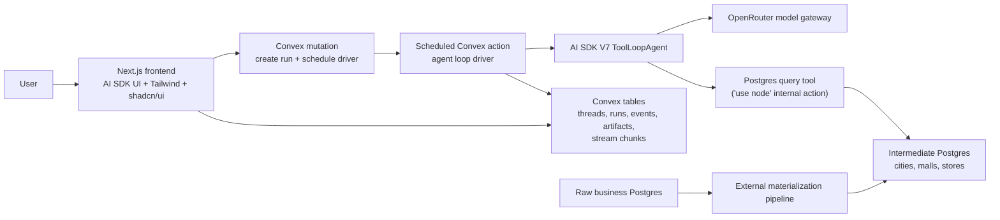

# 01 System Architecture

> **Superseded in part by [11 — Remove Convex](./11-remove-convex.md).** The
> Convex backend described below was replaced by a single long-lived Next.js
> service on Railway with Postgres (Drizzle), tRPC, an in-process run worker,
> and SSE streaming. The agent runtime, tools, skills, and data-access design
> here still apply; read Convex-specific sections as historical context.

## Architecture Overview

V1 uses Convex as the app backend and state store, a separate intermediate Postgres database as the analytical data source, and AI SDK V7 agents as the reasoning/runtime layer. Convex is also the source of truth for in-flight streaming, so live runs survive browser refresh (see [Resumable Streaming](#resumable-streaming)).



## Component Responsibilities

### Frontend

- Claude-like chat shell: collapsible sidebar (pinned + recent sessions), conversation
  column, global search modal, and on-demand artifact panel.
- Stream reasoning, tool calls, and intermediate text live in a single open work
  block per turn, which collapses into a `Worked for Ns` summary when the final
  response starts streaming.
- Reattach to in-flight runs after a refresh: rebuild the live view from persisted
  stream deltas and keep streaming from the Convex subscription.
- Render chat, tool activity, results, charts, and analysis artifacts.
- Use AI SDK UI for streaming agent messages (text, reasoning, and tool parts).
- Use Tailwind and shadcn/ui for layout and controls.
- Keep SQL visible and copyable.

### Run Driver (Scheduled Convex Action)

The agent loop runs in an internal Convex action scheduled by the mutation that
creates the run (`ctx.scheduler.runAfter(0, …)`), so execution starts unconditionally
and never depends on any client connection. Next.js only serves the frontend; there is
no chat HTTP endpoint.

- Execute the `ToolLoopAgent` for the run created by the send-message mutation.
- Pass runtime context: user, org, thread, run, model alias, active skill set.
- Append the agent's UI message stream to `@convex-dev/persistent-text-streaming`,
  one JSON line per part (reasoning delta, tool state change, text delta) — clients
  read it through the reactive `getStreamBody` subscription.
- Bridge agent events into Convex logs.
- Call Postgres tools through `"use node"` internal actions, since the driver runs in
  the V8 runtime.
- Never tie run completion to the client connection; only an explicit stop cancels a
  run.

### Convex

- Store application state, not analytical data.
- Own users, organizations, threads, messages, runs, run events, artifacts, and saved outputs.
- Enforce app-level authorization (a stub in V1's single-user mode; real enforcement
  arrives with Clerk in V2).
- Provide live updates for run state and artifact panels.
- Persist in-flight stream chunks via `@convex-dev/persistent-text-streaming` so live
  runs survive refresh and multiple tabs can watch the same run.

### AI SDK Agent Runtime

- Use `ToolLoopAgent` for interactive analysis.
- Use tools to inspect schema, run SQL, save artifacts, and produce chart specs.
- Use local agent skills to steer domain behavior.
- Use OpenRouter model aliases through a central model registry.

### Intermediate Postgres

- Hold queryable business analysis tables.
- Expose read-only credentials to the agent query tool.
- Apply database-level safety settings such as read-only role and statement timeouts.

### Raw Business Postgres

- Not accessed by the agent.
- Feeds the intermediate database through an external materialization pipeline.

## Runtime Flows

### Interactive Chat Flow

1. User sends a message from the frontend.
2. A Convex mutation stores the message, creates the run and its persistent stream,
   and schedules the driver action with the stream ID.
3. The scheduled action executes the `ToolLoopAgent`.
4. Agent loads relevant skills if needed.
5. Agent calls schema/query tools; Postgres tools run as `"use node"` internal actions.
6. Tools execute against intermediate Postgres.
7. Each streamed part (reasoning, tool state, text) is appended to the persistent
   stream as a JSON line; every open tab renders it through the reactive
   `getStreamBody` subscription.
8. If the user refreshes or reopens the thread mid-run, the client sees the run is
   still active, reads the persisted stream body from a Convex query, and continues
   live from the subscription.
9. Convex stores messages, events, SQL, result previews, chart specs, and final answer;
   the stream is deleted or compacted once the final message is stored.

### Local TUI Flow

1. Developer starts the TUI entrypoint.
2. TUI loads the same agent configuration.
3. TUI uses local environment variables for OpenRouter and Postgres.
4. Developer tests prompts, skills, model aliases, and query behavior quickly.

## Resumable Streaming

Streaming must survive a browser refresh. If the agent is mid-run — thinking, calling
tools, or streaming the final answer — reloading the page reattaches to the same live
run and streaming continues.

Design rules:

1. **Convex is the source of truth for live output.** As the agent streams, the server
   persists every UI message stream part (reasoning deltas, tool-call state changes,
   text deltas) to Convex as an ordered, append-only stream tied to the run.
2. **The run does not depend on the client connection.** Execution lives in an
   internal action scheduled by the run-creating mutation, so it starts and completes
   regardless of what any browser does — including closing immediately after sending.
   Only an explicit stop cancels a run.
3. **Clients render from Convex subscriptions.** A refreshed client loads the thread,
   sees a run with status `running`, replays the persisted stream to rebuild the
   in-progress message, and keeps receiving new parts reactively until the run
   finishes.
4. **The subscription is the only transport.** There is no per-client HTTP stream;
   every tab — initiating, refreshed, or second — renders from the same persisted
   stream, so correctness — including stop, errors, and the final answer — is defined
   by what lands in Convex.
5. **Streams are transient.** Once the run completes and the final assistant message is
   stored, the stream chunks can be compacted or deleted.

### Chosen Implementation

V1 builds directly on `@convex-dev/persistent-text-streaming`:

- A mutation creates the run and the persistent stream, then schedules the driver
  action; the driver runs the `ToolLoopAgent` and appends to the stream via the
  component's chunk mutations, so the run survives disconnects by construction.
- The component streams text, so UI message parts are encoded as JSONL: each part is
  appended as one JSON-serialized line. The client decodes lines back into parts and
  feeds the normal parts renderer. Ordering is preserved because the stream is a
  single append-only body.
- All tabs read the persisted body reactively via `getStreamBody` (the component's
  `driven` HTTP mode is unused). A thin wrapper around its `useStream` hook does the
  JSONL decode.
- Postgres tools cannot run in the driver's V8 runtime; they call `"use node"`
  internal actions via `ctx.runAction`. This also keeps database credentials out of
  the streaming path.
- Stop is a side channel: the loop checks run status at each step boundary and aborts
  in-flight model calls where possible; the component has no built-in cancellation.
  Stop latency of up to one step is accepted for V1.
- Liveness is a heartbeat: the loop stamps `heartbeatAt` on the run at each step
  boundary. A `running` run whose heartbeat is older than ~2 minutes is dead: clients
  render it as failed with its partial output, and a scheduled sweeper marks it
  `failed`.
- One run per thread at a time: the send mutation rejects a new message while the
  thread has a live run; the composer offers stop instead.
- Cleanup is ours: after the final assistant message is stored, delete or compact the
  stream chunks.

### Durable Workflow Flow

V1 can avoid durable workflows unless needed. Use `WorkflowAgent` later for:

- approval waits
- scheduled analysis
- long report generation
- resumable multi-step investigations
- background refreshes

## Required Environment Variables

Names can change during implementation, but the app should centralize access to these values:

```txt
OPENROUTER_API_KEY=
INTERMEDIATE_DATABASE_URL=
CONVEX_DEPLOYMENT=
NEXT_PUBLIC_CONVEX_URL=
```

`OPENROUTER_API_KEY` and `INTERMEDIATE_DATABASE_URL` live in the Convex deployment
environment, since the agent loop and Postgres tools run inside Convex. The TUI reads
the same names from the local environment.

Potential V2 values:

```txt
LANGFUSE_PUBLIC_KEY=
LANGFUSE_SECRET_KEY=
LANGFUSE_BASE_URL=
```

## Auth Posture

V1 has no authentication: the app runs as a single anonymous user.

- No login, no user accounts, no org scoping in V1.
- Keep `userId` fields in the schema now (a constant placeholder value in V1) so Clerk
  can land in V2 without a data migration.
- Convex functions do not authenticate callers in V1; do not expose the deployment
  beyond the intended users.
- V2 adds Clerk: identity on threads/runs/artifacts, per-user pinned sessions, and real
  authorization checks in Convex functions.

## Boundary Rules

- The model never receives database credentials.
- The model never connects directly to Postgres.
- The model only calls typed tools.
- Tools receive credentials through server-side tool context.
- Raw data is not in the agent tool surface.
- Convex stores artifacts and logs, not full analytical warehouse data.

## Failure Handling

| Failure | V1 Behavior |
| --- | --- |
| OpenRouter request fails | Return clear error, save run event, allow retry |
| SQL timeout | Return timeout message, save SQL and timeout metadata |
| SQL error | Return concise DB error, save failed query for debugging |
| Empty result | Explain that the query returned no rows and suggest follow-up |
| Unknown schema | Ask the schema tool first, then continue or fail clearly |
| Client disconnect or refresh | Run continues in the scheduled action; client reattaches and replays the persisted stream |
| Server dies mid-run | Heartbeat goes stale; sweeper (or the next send) finalizes the run as failed with a visible assistant message holding any partial output; retry allowed |

## Architecture Risks

- OpenRouter model behavior varies by underlying model; model aliases and evals are mandatory.
- Skills steer behavior but do not enforce safety.
- A tiny schema reduces V1 risk, but SQL transparency is still important for trust.
- Deferred semantic layer means table/column naming must carry more meaning.

